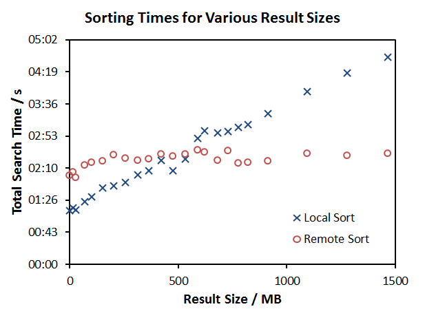

In the 2.0 version of Logdriver, the Logsearch tool implements the ability to choose to sort search results either on the machine that initiated the search, or on the cluster itself. By default this decision is made based on the size of the compressed results; If the (compressed) size of the log lines found during the search exceeds 256 MB, the Pig jobs that sort the results will run on the cluster. Below this size, the files are copied to the local machine and the Pig jobs are run in local mode. 

It is possible to force the sorting to happen locally or remotely by using the -l and -r flags, respectively. Note that forcing remote sorting may be necessary when there is limited local space available to the user initiating the search. Forcing local search may be useful in situations where results are low priority and it is desirable to minimize the impact of the search on the cluster. 

For local sorting, there must be enough local storage available to the user for the total size of the compressed and uncompressed results (usually approximately 10x the compressed result size). 

Local sort times tests done versus remote sort times are presented below. 

